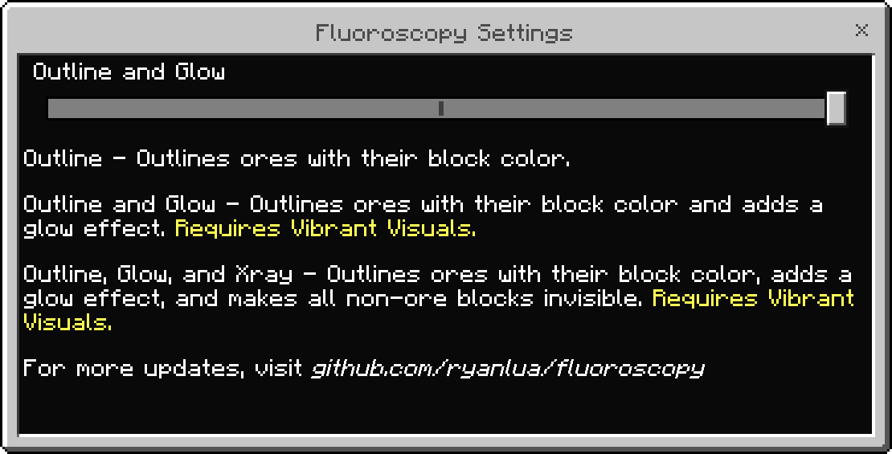

<h1 align="center">
  
</h1>

A Minecraft Bedrock Vibrant Visuals resource pack that outlines and glows ores with their block color with optional x-ray. Fluoroscopy is designed around the [new Bedrock Textures](https://www.minecraft.net/en-us/article/try-new-bedrock-textures) to match vanilla as much as possible.

There are three settings to choose from, each providing a different level of visibility for ores:

> [!WARNING]
> Settings other than **Outline** require [Vibrant Visuals](https://www.minecraft.net/en-us/vibrant-visuals-update) to be enabled.

- **Outline**: Outlines ores with their block color.
- **Outline and Glow (default)**: Outlines ores with their block color and adds a glow effect.
- **Outline, Glow, and X-ray**: Outlines ores with their block color, adds a glow effect, and makes all non-ore blocks invisible.

Each of the three settings can be seen below in both the Overworld and The Nether:

| Setting                    | Overworld                                                                               | The Nether                                                                           |
| -------------------------- | --------------------------------------------------------------------------------------- | ------------------------------------------------------------------------------------ |
| Outline                    |                 |                |
| Outline and Glow (default) |            |           |
| Outline, Glow, and X-ray   |  |  |

## Ores

This resource pack adds colored outlines to all ore blocks in Minecraft, including:

- [x] Coal Ore
- [x] Iron Ore
- [x] Copper Ore
- [x] Gold Ore
- [x] Nether Gold Ore
- [x] Gilded Blackstone
- [x] Redstone Ore
- [x] Emerald Ore
- [x] Lapis Lazuli Ore
- [x] Diamond Ore
- [x] Nether Quartz Ore
- [x] Ancient Debris

All deepslate variants are also included with matching outlines.

