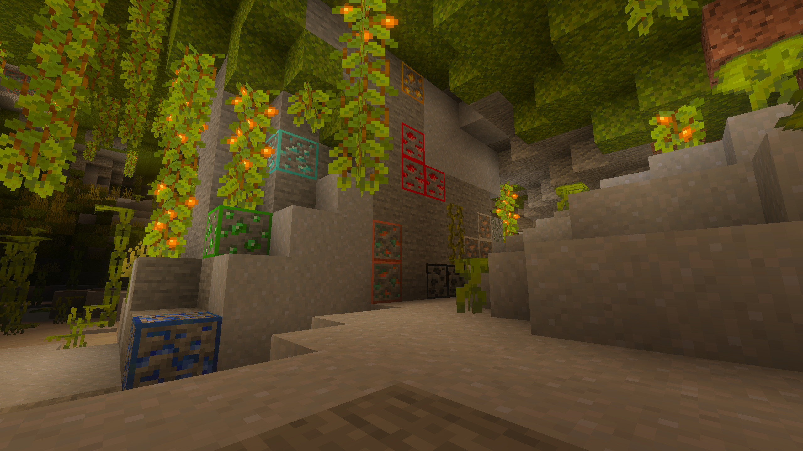
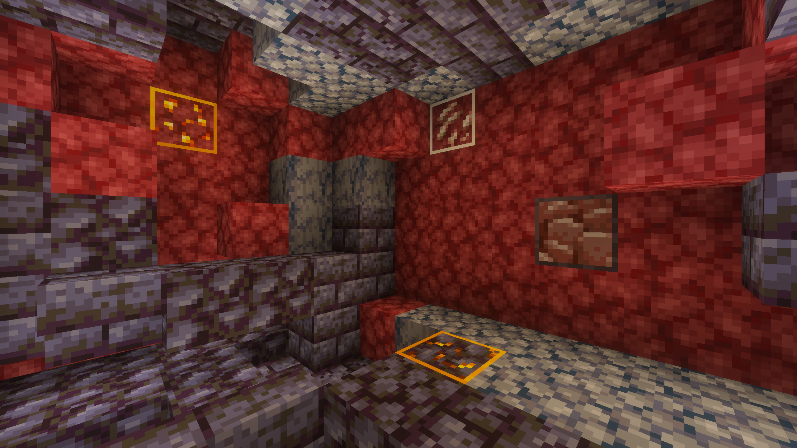
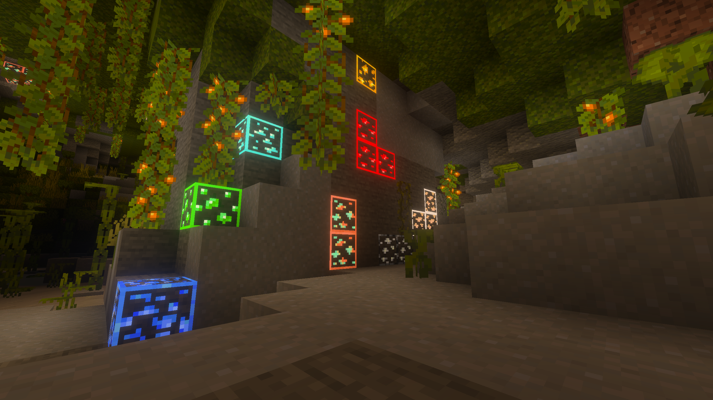
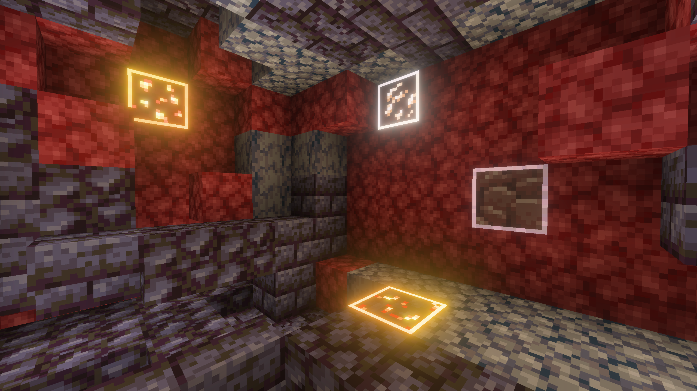
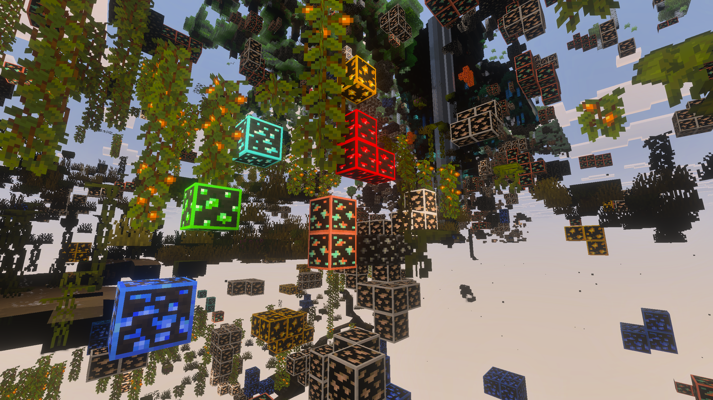
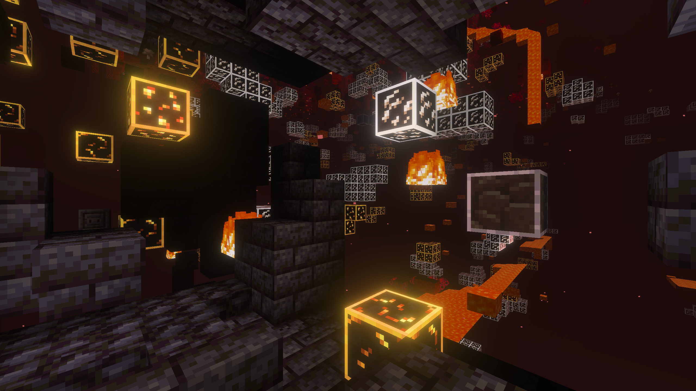

<h1 align="center">
  
</h1>

A Minecraft Bedrock resource pack that outlines ores with their block color for faraway identification and easier mining. Fluoroscopy is designed around the [new Bedrock Textures](https://www.minecraft.net/en-us/article/try-new-bedrock-textures) and supports Vibrant Visuals.

| Setting                 | Overworld                                                                              | The Nether                                                                           |
| ----------------------- | -------------------------------------------------------------------------------------- | ------------------------------------------------------------------------------------ |
| Outline                 |                |                |
| Outline and Glow        |           |           |
| Outline, Glow, and Xray |  |  |

## Ores

This resource pack adds colored outlines to all ore blocks in Minecraft, including:

- [x] Coal Ore
- [x] Iron Ore
- [x] Copper Ore
- [x] Gold Ore
- [x] Nether Gold Ore
- [x] Gilded Blackstone
- [x] Redstone Ore
- [x] Emerald Ore
- [x] Lapis Lazuli Ore
- [x] Diamond Ore
- [x] Nether Quartz Ore
- [x] Ancient Debris

All deepslate variants are also included with matching outlines.

